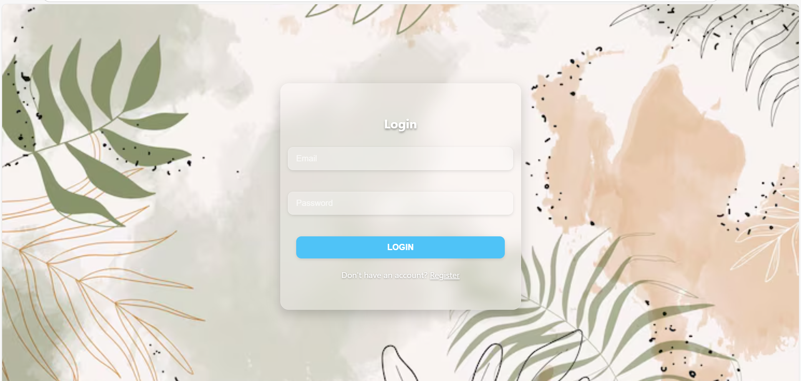
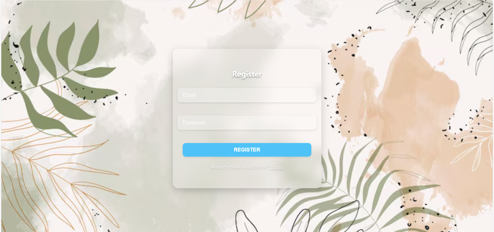
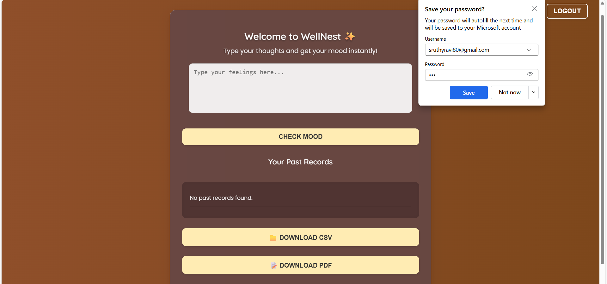
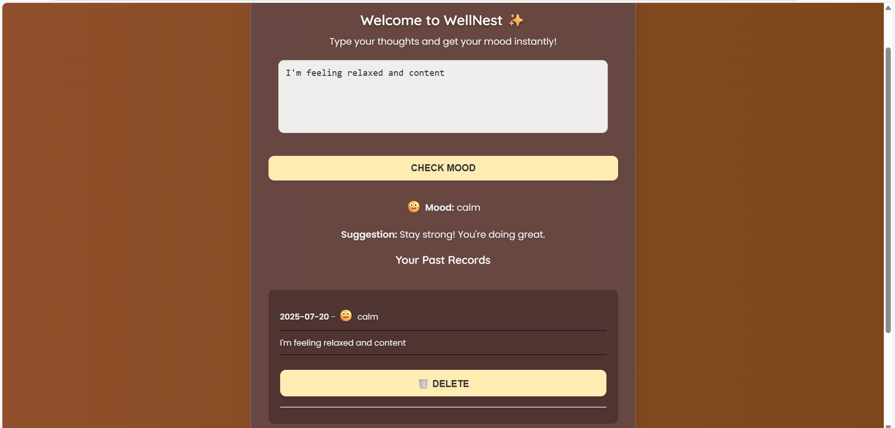
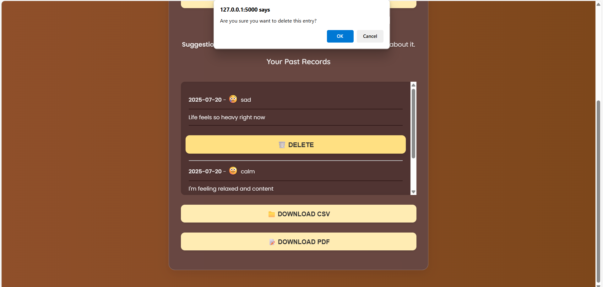

# 🌿 WellNest — Mood Detection Journal App

WellNest is a lightweight web application that allows users to express their thoughts and receive mood predictions using an AI model. The app also provides personalized mental wellness suggestions and keeps a history of journal entries for self-reflection.

---

## ✨ Features

- 🧠 AI-based mood prediction (happy, sad, angry, anxious)
- ✍️ Journal your daily thoughts
- 📊 View and manage past records
- 📁 Export mood history as PDF/CSV
- 🧼 Delete individual journal entries
- 🧍 User authentication (Register/Login/Logout)
- 🎨 Beautiful responsive UI with emoji mood icons
- ☁️ Deployed using Render (or host locally)

---

## 🚀 Tech Stack

- **Frontend:** HTML, CSS, JavaScript
- **Backend:** Python Flask
- **Database:** SQLite
- **AI/ML:** Scikit-learn (ML model using `CountVectorizer` and `LogisticRegression`)
- **PDF & CSV Export:** ReportLab, Python CSV
- **Deployment:** GitHub + Render

---

## 📸 Screenshots

### Login Page  


### Register Page  


### Dashboard - Mood Input  


### Dashboard  


### Dashboard 


---

## 🛠️ How to Run Locally

### 1. Clone the Repository

```bash
git clone https://github.com/YOUR-USERNAME/wellnest-lite.git
cd wellnest-lite

### 2. Create a Virtual Environment

python -m venv venv
venv\Scripts\activate   # On Windows
# OR
source venv/bin/activate  # On macOS/Linux

### 3. Install Requirements

pip install -r requirements.txt

### 4. Train the ML Model (Optional)
If not already present, you can retrain the model:
cd backend
python train_model.py

### 5. Run the App

python app.py
Then open your browser: http://127.0.0.1:5000

###📦 Folder Structure
wellnest-lite/
├── backend/
│   ├── app.py
│   ├── train_model.py
│   ├── model.pkl
│   └── instance/
│       └── users.db
├── templates/
│   ├── login.html
│   ├── register.html
│   └── dashboard.html
├── static/
│   ├── style.css
│   └── script.js
├── dataset/
│   └── mood_data.csv
├── requirements.txt
└── README.md


🙋‍♀️ Author
Sruth Ravi
B.Tech CSE | Passionate about AI + Web Development
GitHub Profile

📃 License
This project is open-source and free to use under the MIT License.